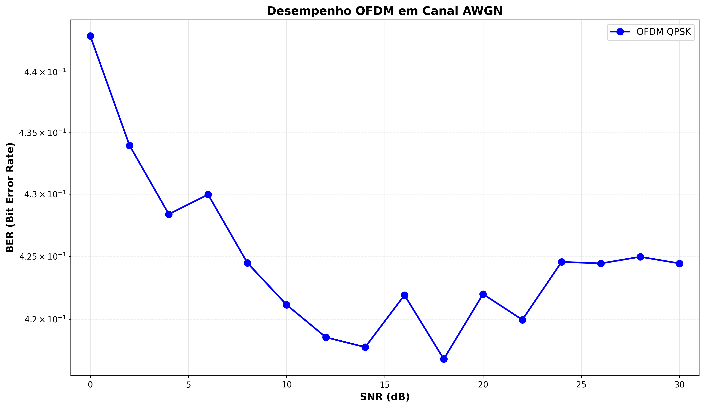

# Simulador de Modulação Digital e OFDM

Sistema completo de simulação para telecomunicações, implementando múltiplos esquemas de modulação digital e um simulador OFDM configurável para análise de desempenho em canais AWGN.

## 📋 Visão Geral

Este projeto oferece duas abordagens complementares:

1. **Framework Modular** (`entities/`): Sistema orientado a objetos com transmissores, receptores e canais para simulações educacionais
2. **Simulador OFDM** (`ofdm_simulation.py`): Simulador independente e configurável para análise BER vs SNR em sistemas OFDM

---

## 🎯 Simulador OFDM (`ofdm_simulation.py`)

### Descrição

Simulador completo de sistema OFDM (Orthogonal Frequency-Division Multiplexing) com suporte a:
- Modulação 16-QAM com Gray coding nas subportadoras
- Prefixo cíclico configurável para mitigação de ISI
- Upconversion/downconversion para frequência de portadora (RF)
- Canal AWGN com SNR configurável
- Análise de BER vs SNR
- Visualização gráfica dos resultados

### Como Funciona

O simulador implementa um transmissor/receptor OFDM completo seguindo estas etapas:

**Transmissão:**
1. Gera bits aleatórios
2. Agrupa em símbolos 16-QAM (4 bits por símbolo)
3. Aplica IFFT para criar símbolo OFDM no domínio do tempo
4. Adiciona prefixo cíclico (CP)
5. Upconverte para frequência de portadora (opcional)
6. Transmite pelo canal AWGN

**Recepção:**
7. Downconverte para banda base
8. Remove prefixo cíclico
9. Aplica FFT para recuperar símbolos no domínio da frequência
10. Demodula 16-QAM por mínima distância
11. Calcula BER comparando com bits transmitidos

### Configuração de Parâmetros

Todas as variáveis de entrada estão centralizadas na função `main()` (linhas 465-530):

```python
def main():
    # ============================================================================
    # CONFIGURAÇÃO DOS PARÂMETROS
    # ============================================================================
    
    # Taxa de bits desejada (Mbps)
    bit_rate = 10e6  # 10 Mbps ← ALTERE AQUI
    
    # Largura de banda disponível (MHz)
    bandwidth = 200e6  # 200 MHz ← ALTERE AQUI
    
    # Atraso máximo do canal (µs)
    max_delay = 200e-9  # 0.2 µs ← ALTERE AQUI
    
    # Tempo de guarda (deve ser > 2×max_delay)
    guard_time = 2*max_delay  # 0.4 µs ← ALTERE AQUI
    
    # Tempo de símbolo como múltiplo do tempo de guarda
    symbol_time_multiplier = 7  # Ts = 7 × Tg ← ALTERE AQUI
    
    # Frequência da portadora
    carrier_freq = 2.4e9  # 2.4 GHz (WiFi) ← ALTERE AQUI
    # carrier_freq = None  # Descomente para banda base
    
    # Fator de sobreamostragem para portadora
    oversampling_factor = 8  # ← ALTERE AQUI
    
    # Número de símbolos OFDM por frame
    num_symbols = 12  # ← ALTERE AQUI
    
    # Range de SNR para teste (dB)
    snr_range = np.arange(0, 31, 2)  # 0 a 30 dB, passo de 2 dB ← ALTERE AQUI
```

### Parâmetros Detalhados

| Parâmetro | Descrição | Impacto | Valores Típicos |
|-----------|-----------|---------|-----------------|
| `bit_rate` | Taxa de bits desejada (bps) | Define throughput do sistema | 1 Mbps - 100 Mbps |
| `bandwidth` | Largura de banda disponível (Hz) | Limita número de subportadoras | 20 MHz - 200 MHz |
| `max_delay` | Atraso máximo do canal (s) | Determina ISI esperado | 0.1 µs - 1 µs |
| `guard_time` | Tempo de guarda/CP (s) | Proteção contra ISI (deve ser > 2×max_delay) | 0.2 µs - 2 µs |
| `symbol_time_multiplier` | Multiplicador Ts = m × Tg | Razão símbolo útil / guarda | 4 - 10 |
| `carrier_freq` | Freq. da portadora (Hz) | RF ou banda base (`None`) | 2.4 GHz, 5 GHz, `None` |
| `oversampling_factor` | Sobreamostragem para portadora | Qualidade da modulação RF | 4 - 16 |
| `num_symbols` | Símbolos OFDM por frame | Tamanho do frame de teste | 10 - 100 |
| `snr_range` | Valores de SNR para teste (dB) | Pontos da curva BER vs SNR | 0 a 40 dB |

### Como Executar

```bash
# Execute o simulador
python ofdm_simulation.py
```

**Saída esperada:**
1. Configuração do sistema OFDM (parâmetros calculados)
2. Simulação BER vs SNR (progresso por SNR)
3. Métricas de transmissão (throughput, overhead, etc.)
4. Gráfico salvo em `ofdm_ber_vs_snr.png`

### Estrutura do Código

```
OFDMTransmitter (classe principal)
├── __init__()              # Calcula parâmetros do sistema
├── qam16_modulate()        # Modula bits → símbolos 16-QAM
├── qam16_demodulate()      # Demodula símbolos → bits
├── add_cyclic_prefix()     # Adiciona CP
├── remove_cyclic_prefix()  # Remove CP
├── upconvert_to_carrier()  # Banda base → RF
├── downconvert_from_carrier()  # RF → Banda base
├── transmit_frame()        # Transmite frame completo
└── receive_frame()         # Recebe frame completo

Funções auxiliares:
├── awgn_channel()          # Adiciona ruído AWGN
├── calculate_ber()         # Calcula BER
├── simulate_ber_vs_snr()   # Loop de simulação
└── plot_ber_vs_snr()       # Gera gráfico
```

### Modificando a Modulação

Para alterar o esquema de modulação das subportadoras:

**Trocar 16-QAM para QPSK:**
```python
# Na linha 60, altere:
self.bits_per_symbol = 2  # QPSK (ao invés de 4 para 16-QAM)

# Renomeie/substitua os métodos qam16_modulate e qam16_demodulate
# por qpsk_modulate e qpsk_demodulate
```

**Trocar para BPSK:**
```python
self.bits_per_symbol = 1  # BPSK
# Implemente bpsk_modulate e bpsk_demodulate
```

### Resultados

#### Configuração Testada

- **Taxa de bits**: 10 Mbps (solicitada) → 731.43 Mbps (efetiva)
- **Largura de banda**: 200 MHz
- **Subportadoras**: 512 (FFT)
- **Modulação**: 16-QAM (4 bits/subportadora)
- **Prefixo cíclico**: 14.3% overhead
- **Portadora**: 2.4 GHz
- **Tempo de símbolo**: 2.8 µs (Tu = 2.4 µs, Tg = 0.4 µs)

#### Gráfico BER vs SNR



**Análise:**
- BER elevado (~42%) devido à sensibilidade do 16-QAM ao ruído
- 16-QAM oferece **dobro da taxa de dados** comparado a QPSK, mas requer **SNR mais alto**
- Para BER < 10⁻³, seria necessário SNR > 25 dB com equalização ou codificação de canal

#### Métricas Reportadas

```
Total de bits transmitidos por frame:  24576
Duração do frame:                      33.60 µs
Taxa de transmissão efetiva:           731.43 Mbps
Overhead do prefixo cíclico:           14.3%
Eficiência espectral:                  3.66 bps/Hz
```

### Melhorando o Desempenho

Para reduzir o BER:

1. **Aumentar SNR**: Maior potência de transmissão ou melhor receptor
2. **Codificação de Canal**: Adicionar FEC (Reed-Solomon, Turbo codes)
3. **Equalização**: Compensar distorções do canal
4. **Modulação Adaptativa**: Usar QPSK em baixo SNR, 16-QAM em alto SNR
5. **Aumentar CP**: Maior proteção contra ISI (mas reduz eficiência)
6. **Pilotos**: Melhorar estimação de canal

---

## 🏗️ Framework Modular (`entities/`)

### Arquitetura

O sistema segue arquitetura de três camadas:

#### Classes Base (Abstratas)

- **`BaseTransmitter`**: Transmissor abstrato com interface de modulação, normalização e upconversion
- **`BaseReceiver`**: Receptor abstrato com interface de demodulação, AGC e downconversion  
- **`BaseChannel`**: Canal abstrato para transmissão e modelagem de imperfeições

#### Implementações Concretas

**Transmissores** (`entities/`)

- **`BPSKTransmitter`**: Binary Phase-Shift Keying (1 bit/símbolo)
  - Formatação de pulso Root Raised Cosine (RRC)
  - Modulação de fase: 0° e 180°
  
- **`ASK4Transmitter`**: 4-level Amplitude-Shift Keying (2 bits/símbolo)
  - Quatro níveis de amplitude: -3, -1, +1, +3
  - Mapeamento Gray-coded
  
- **`QAM16Transmitter`**: 16-Quadrature Amplitude Modulation (4 bits/símbolo)
  - Constelação 4×4 com modulação I/Q
  - Gray coding e normalização de potência
  
- **`OFDMTransmitter`**: Orthogonal Frequency-Division Multiplexing (configurável)
  - Múltiplas subportadoras ortogonais (padrão: 128)
  - Prefixo cíclico para mitigação de ISI
  - Modulação de subportadora configurável (BPSK/QPSK/16-QAM)
  - Modulação eficiente baseada em IFFT
  - Alta eficiência espectral (>12k bits/s/Hz)

**Receptores** (`entities/`)

- **`BPSKReceiver`**: Demodulação BPSK com decisão de limiar zero
- **`ASK4Receiver`**: Demodulação 4-ASK com detecção baseada em limiar
- **`QAM16Receiver`**: Demodulação 16-QAM com decisão hard/soft
- **`OFDMReceiver`**: Demodulação OFDM
  - Recuperação de subportadora baseada em FFT
  - Remoção de prefixo cíclico
  - Demodulação por subportadora
  - Medição de EVM (Error Vector Magnitude)

**Canais** (`entities/`)

- **`AWGNChannel`**: Additive White Gaussian Noise
  - SNR configurável em dB
  - Cálculo teórico de BER para BPSK/QPSK/16-QAM
  - Geração de ruído Gaussiano complexo

### Camada de Integração

- **`Transmission`**: Sistema de transmissão end-to-end
  - Integra transmissor + canal + receptor
  - Cálculo automático de BER, SNR, throughput
  - Métricas de tempo de transmissão e largura de banda
  - Suporte para texto, bytes e dados arbitrários
<!-- 
## 💻 Uso do Framework

### Exemplo Básico

```python
from entities import QAM16Transmitter, QAM16Receiver, AWGNChannel, Transmission

# Criar componentes
transmitter = QAM16Transmitter(sample_rate=1e6, carrier_freq=2.4e9)
receiver = QAM16Receiver(sample_rate=1e6, carrier_freq=2.4e9)
channel = AWGNChannel(snr_db=20)

# Integrar no sistema de transmissão
system = Transmission(transmitter, channel, receiver)

# Transmitir texto
message = "Hello, OFDM!"
rx_text, metrics = system.transmit_text(message)

print(f"Received: {rx_text}")
print(f"BER: {metrics['ber']:.2e}")
print(f"Transmission Time: {metrics['transmission_time']*1000:.2f} ms")
```

### Exemplo OFDM (Framework)

```python
from entities import OFDMTransmitter, OFDMReceiver, AWGNChannel, Transmission

# Criar sistema OFDM com modulação QPSK nas subportadoras
tx = OFDMTransmitter(
    sample_rate=1e6,
    num_subcarriers=128,
    cp_length=32,
    subcarrier_modulation='QPSK',
    carrier_freq=2.4e9
)

rx = OFDMReceiver(
    sample_rate=1e6,
    num_subcarriers=128,
    cp_length=32,
    subcarrier_modulation='QPSK',
    carrier_freq=2.4e9
)

channel = AWGNChannel(snr_db=25)
system = Transmission(tx, channel, rx)

# Transmitir dados de áudio
audio_bytes = generate_audio()  # Seus dados de áudio
rx_audio, metrics = system.transmit_bytes(audio_bytes)

print(f"Bit Rate: {tx.get_bit_rate()/1e6:.2f} Mbps")
print(f"Spectral Efficiency: {tx.get_spectral_efficiency():.2f} bits/s/Hz")
``` -->
<!-- 
## 🧪 Testes Disponíveis

### Testes Single-Carrier

- **`test_qam16_transmission.py`**: Transmissão de texto com 16-QAM
  - 10.000 caracteres
  - Análise de curva BER vs SNR (0-25 dB)
  - Visualização de diagrama de constelação
  - Frequência de portadora: 450 MHz
  
- **`test_ask4_long_transmission.py`**: Transmissão 4-ASK de longa distância
  - 10k caracteres em <2 segundos
  - Análise de diagrama de olho e dispersão temporal
  - Histograma de símbolos recebidos

- **`test_qam16_image_transmission.py`**: Transmissão de imagem RGB
  - Imagem RGB de 100×100 pixels
  - Tempo de transmissão: <3 segundos
  - Medição de PSNR (Peak Signal-to-Noise Ratio)
  - Visualização de comparação antes/depois

- **`test_qam16_video_transmission.py`**: Transmissão de vídeo
  - 10 quadros em escala de cinza (100×100 pixels)
  - Tempo de transmissão: <1 segundo
  - Análise de PSNR por quadro
  - Reconstrução de sequência animada

### Testes Multi-Carrier

- **`test_ofdm_audio_transmission.py`**: Transmissão de áudio OFDM
  - 5 segundos de áudio @ 16 kHz, 16 bits/amostra, mono
  - 160.000 bytes (1,28 Mbits) transmitidos em 813 ms
  - Taxa de transmissão: 1,575 Mbps
  - Conjunto abrangente de visualizações:
    - Comparação de forma de onda (original vs recebido)
    - Análise de espectro de frequência
    - Distribuição de sinal de erro
    - Diagrama de constelação OFDM
    - BER ao longo do tempo
    - Medição de THD (Total Harmonic Distortion)
    - Análise de EVM RMS -->

## 📊 Métricas de Desempenho

Todos os sistemas de transmissão calculam automaticamente:

- **BER** (Bit Error Rate): Razão de erros de bit para bits totais
- **SER** (Symbol Error Rate): Razão de erros de símbolo para símbolos totais
- **SNR** (Signal-to-Noise Ratio): Em dB
- **Throughput**: Taxa de dados efetiva em bps
- **Transmission Time**: Duração real do sinal em segundos
- **Bandwidth Used**: Espectro ocupado em Hz
- **PSNR** (para imagens/vídeo): Métrica de qualidade de imagem em dB
- **EVM RMS** (para OFDM): Magnitude de erro de constelação em %
- **THD** (para áudio): Distorção harmônica total em %

## 🔧 Dependências

```python
numpy          # Processamento de sinal e operações numéricas
matplotlib     # Visualização e plotagem
Pillow (PIL)   # Processamento de imagem para testes de transmissão
scipy          # Processamento de sinal (usado em ofdm_simulation.py)
```

Instalar com:

```bash
pip install -r requirements.txt
```

## 📁 Estrutura do Projeto

```text
radio-frequency/
├── entities/
│   ├── __init__.py
│   ├── base_transmitter.py      # Transmissor abstrato
│   ├── base_receiver.py         # Receptor abstrato
│   ├── base_channel.py          # Canal abstrato
│   ├── bpsk_transmitter.py      # Implementação BPSK
│   ├── bpsk_receiver.py
│   ├── ask4_transmitter.py      # Implementação 4-ASK
│   ├── ask4_receiver.py
│   ├── qam16_transmitter.py     # Implementação 16-QAM
│   ├── qam16_receiver.py
│   ├── ofdm_transmitter.py      # Implementação OFDM
│   ├── ofdm_receiver.py
│   ├── awgn_channel.py          # Modelo de canal AWGN
│   └── transmission.py          # Camada de integração
├── ofdm_simulation.py           # Simulador OFDM standalone
├── test_qam16_transmission.py
├── test_ask4_long_transmission.py
├── test_qam16_image_transmission.py
├── test_qam16_video_transmission.py
├── test_ofdm_audio_transmission.py
├── ofdm_ber_vs_snr.png         # Gráfico de resultados OFDM
├── requirements.txt
└── README.md
```

## 🎓 Aplicações Educacionais

Este simulador é ideal para:

- Compreender teoria de modulação digital
- Analisar desempenho de BER sob ruído
- Comparar sistemas single-carrier vs multi-carrier
- Visualizar diagramas de constelação e padrões de olho
- Estudar mitigação de ISI com formatação de pulso
- Explorar princípios de OFDM e prefixo cíclico
- Medir trade-offs de eficiência espectral
- Cenários de transmissão de dados do mundo real (texto, imagens, áudio, vídeo)

## 🚀 Executando Testes

Execute scripts de teste individuais:

```bash
# Testes do framework
python test_qam16_transmission.py
python test_ofdm_audio_transmission.py

# Simulador OFDM
python ofdm_simulation.py
```

Cada teste gera visualizações abrangentes e métricas de desempenho.

## 📈 Recursos

✅ Múltiplos esquemas de modulação (BPSK, 4-ASK, 16-QAM, OFDM)  
✅ Gray coding para desempenho ideal de BER  
✅ Formatação de pulso RRC para redução de ISI  
✅ Automatic Gain Control (AGC)  
✅ Upconversion/downconversion de frequência de portadora  
✅ Canal AWGN com SNR configurável  
✅ Métricas abrangentes (BER, SNR, PSNR, EVM, THD)  
✅ Testes de transmissão do mundo real (texto, imagens, áudio, vídeo)  
✅ Conjunto rico de visualizações (constelações, espectros, diagramas de olho)  
✅ OFDM com prefixo cíclico e processamento FFT/IFFT  
✅ Simulador OFDM standalone com análise BER vs SNR  

## 📝 Licença

Consulte o arquivo `LICENSE` para detalhes.

## 👥 Contribuidores

Desenvolvido para o curso de Eletrônica para Telecomunicações do IFES.
